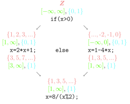

# CheeseBread Analysis
- UFMG Compiler's Lab

## Prerequisites
- Python3
- Clang-{16,18,20}

## Setup
- [reference](https://gitcode.com/Cangjie/cangjie_build/blob/main/doc_en/linux.md)
- Initialize submodules
```sh
git submodule update --init --recursive
cd cangjie_runtime
git checkout v1.2.0-beta.02
```
- Run the setup script. `./setup.sh`

## TODO:
- [ ] Read ranges from a `input.txt` file
- [ ] Output results to a `output.txt` file
- [ ] Teams must provide a video introduction of their work
- [ ] build the cangjie-sdk on a Linux aarch64 machine
- [ ] Define the constraints:
```c++
class Constraint {
    public:
        virtual void eval() = 0;
    private:
        std::set<unsigned> liverange; // lines where the variable is alive!
}

class PhiConstraint public Constraint {
    public:
        virtual void eval() { /* meet of intervals of the parameters */};
}

class InitConstraint public Constraint {
    public:
        virtual void eval() { /* assignment of a constant */};
}

class IntersectionConstraint public Constraint {
    public:
        virtual void eval() { /* Intersection with stuff */};
}

class OpConstraint public Constraint {
    public:
        virtual void eval() = 0;
}

class AddConstraint public OpConstraint {
    public:
        virtual void eval() { /* [L0 + L1, U0 + U1] */};
}
```


## Submitting:
- After a successful submission, the backend will evaluate the code you
  submitted and return the results like follows:

  


---
# Statement
> Technical Proposal for National College Student Computer Systems Capability
> Competition 2026 - Compiler System Design Challenge (Huawei BiSheng Cup):
> "Cangjie High-Performance Range Analysis"

## Overview of the Competition Topic

1. This competition topic, titled "Cangjie High-Performance Range Analysis"
   (hereinafter referred to as "this competition topic"), requires participating
   teams to implement a range analysis algorithm that can efficiently perform
   value domain analysis on integer type  Int8, Int16, Int32, Int64, UInt8,
   UInt16, UInt32, UInt64 and boolean type Boolean data in the given Cangjie
   code.

2. The definition of Range Analysis is provided in the definition linked in
   Appendix [1], which refers to the analysis of possible values of variables at
   a certain program point through static analysis techniques. In compilers,
   Range Analysis results are typically used to enable various static checks and
   optimizations (such as bounds checking, dead branch elimination, etc.).



3. Except for any specific requirements, provisions, or prohibitions specified
   in this technical proposal, each team may independently decide on the details
   of optimization techniques and other aspects they choose to use.

## Preliminary Round Content

Implement a high-performance Range Analysis algorithm for the Cangjie language
at the Cangjie High-Level Intermediate Representation (CHIR) layer, to analyze
and derive the value range information of integer and boolean type data in the
given Cangjie code.

1. The test cases used for scoring consist of a set of Cangjie package source
   codes that can be compiled and built using the Cangjie Project Management
   Tool (`cjpm`). Each Cangjie package constitutes an independent test case.

2. In addition to containing the source code of a Cangjie package, the test case
   also includes an `input.txt` file. Each line in this file specifies the value
   range of a specified variable in a specified line of a specified CHIR file
   that the participating teams need to output. The format of each line in the
   file is as follows:

```
[fileName, line, variableName]
```

Where,

- `fileName` is the name of the CHIR file;
- `line` is the line number in the specified CHIR file;
- `variableName` is the name of the variable whose possible value before `line`
  is executed needs to be output by the team.

3. Participants are required to implement the Range Analysis algorithm in the
   Cangjie front-end compiler to perform static analysis on the intermediate
   language CHIR generated by the Cangjie compilation front end.

4. Participants need to output an `output.txt` file, where each line contains
   the result of the Range Analysis for the specified variable in the
   corresponding line of the `input.txt` file. The format of each line is as
   follows, and the organizers ensure that the output for all test cases can be
   represented using this format.

    - If the specified variable is of integer type, the output format should
  follow the sequence below:

    ```
    a, b, c, [e, d:s]
    ```

    Teams can represent their analysis results by enumerating integers, for
    example: `a, b, c` represent three different integers; \
    they can also use interval notation to represent the results, such as `[e,
d:s]`, which represents all integers greater than or equal to `e` and less than
or equal to `d` with a step size of `s`; \
    or they can mix both enumeration and
interval notations, for example: `a, b, [e, d:s]`.

    - If the specified variable is of boolean type, the output format should
      follow the sequence below:

    ```
    a, b
    ```

Teams represent the analysis results of boolean variables by enumeration. Here,
the values of `a` and `b` are either `true` or `false`.

## Functional Testing

For each test case, points are awarded based on the specified variables in
`input.txt`. For each variable, the output result must exactly match the
standard answer or **the given range of values must be a SUPERSET of the
standard answer to receive points**. Each specified variable is worth up to 2
points. The scoring rules are as follows:

$$ \text{Functional Test Score} = \frac{\text{Number of elements in the standard
answer}}{\text{Number of elements in the output}} \times 2.0 $$

The final functional test score is calculated by dividing the sum of the scores
of all specified variables by the number of test cases and converting it to a
percentage scale. For example, if a test case has 10 lines of input, the final
score will be multiplied by 5 in order to convert it to a percentage system.


## Performance Test

A performance score is conditionally awarded if the analysis results of all
specified variables for a test case in the functional test are non-zero. The
competing programs are ranked according to their running times and assigned
scores on a percentage scale. For example, if there are five competing programs,
the one with the shortest running time receives 100 points (on a percentage
scale), the slowest one receives 0 points, and the others receive 75, 50, and 25
points respectively. **If any specified variable in a test case receives a score
of 0 in the functional test, the competing program will be treated as having a
score of 0**.

Note: Test cases must be limited to `10,000` lines of code and have a
compilation and runtime of no more than `3 minutes`.

> :question: Is this really a static analysis?

## Final Round Content

The final round consists of two stages. The first stage is to continue
optimizing the works, and the competition requirements are consistent with those
of the preliminary round. 

The second stage is the on-site presentation that mainly assesses the team's
collaboration, the completeness of the submitted code, the design documentation,
technical innovation, code standardization, and the effectiveness of the on-site
presentation. Specific competition requirements and scoring criteria will be
announced separately during the final round.

## Submission of Entries

Each participating team shall submit the following contents on the competition
platform during both the preliminary and final stages:

1. The implementation source code of the high-performance Range Analysis for
   Cangjie. Participating teams must ensure that the submitted source code can
   run on the competition platform. The organizers will provide reference
   testing tools/methods for teams to assist with debugging; however, the final
   test results will be determined by the organizers.

2. Relevant design documents (in PDF format) shall be included, but are not
   limited to: descriptions of functions, performance, and innovation, relevant
   test results, comparative analysis with similar projects, bottlenecks
   encountered and their solutions, etc.

**Teams must provide a video introduction of their work** (in MP4 format) with a
duration not exceeding 5 minutes during the preliminary stage.

Teams are allowed to reference or use some code from compilation systems or
software modules that follow open-source agreements. If third-party IP or
partial source code from others needs to be used, it must be clearly stated in
the header of the design documents and source code, and the content must comply
with relevant laws, regulations, and open-source agreements.

Teams must strictly adhere to academic integrity. Any team found to have engaged
in academic misconduct, such as code plagiarism or using others' code without
proper attribution, or having a modified code repetition rate exceeding 20%,
will be disqualified from the competition.

### Submission Format Requirements:

A file named `cjc.zip`. After extraction, it should generate a `cangjie/`
directory with the same format as the official Cangjie SDK release
(cangjie-sdk). When compiling from the Cangjie source repository, the output is
automatically in this format, except for `cjpm`, which needs to be copied
manually:

```
cangjie
├── bin
│   ├── cjc
│   └── cjc-frontend -> cjc
├── envsetup.sh
├── lib
│   ├── linux_aarch64_cjnative
│   │   ├── cjld.lds
│   │   ├── cjld.shared.lds
│   │   ├── cjstart.o
│   │   ├── cld.lds
│   │   └── discard_eh_frame.lds
├── modules
│   ├── linux_aarch64_cjnative
│   │   └── std
├── runtime
│   └── lib
│       ├── linux_aarch64_cjnative
│       │   ├── libpcre2-8.so.0 -> libpcre2-8.so.0.14.0
│       │   └── libpcre2-8.so.0.14.0
├── third_party
└── tools
    ├── bin
    │   ├── cjpm
    └── lib
```

The diagram above is for illustration purposes and does not list every item
completely; the `include/` directory may be omitted.

Note: **If your cjpm is compiled from source, it must be statically linked**. If
it dynamically links to the cangjie-stdx libraries, it will not run on the
platform. You may use the cjpm from the official release package, which
satisfies this requirement.

The evaluation platform runs Linux aarch64, so **you must build the cangjie-sdk
on a Linux aarch64 machine**. The Cangjie source repository currently does not
support cross-compilation from Linux x64 to Linux aarch64.

## Example

- `src/main.cj`
```cj
package llvm_style_public_example

public func mask(v: Int64): Int64 {
    v & 7
}

main(): Int64 {
    var p: Int64 = 0
    for (k in 0..=2) {
        var x: Int64 = 0
        if (k == 0) {
            x = 13
        } else {
            if (k == 1) {
                x = 24
            } else {
                x = 40
            }
        }
        var b: Int64 = mask(x)
        p = p + b + k
    }
    return p
}
```

- `input.txt`
```
[src/main.cj, 21, x]
[src/main.cj, 21, b]
```

- `cjpm.toml`
```toml
[package]
cjc-version = "1.0.0"
name = "llvm_style_public_example"
version = "0.1.0"
output-type = "executable"
compile-option = "-O2"
link-option = ""
src-dir = "src"
target-dir = "target"
```

- Expected output:
```
13, 24, 40
0, 5
```

### Explanation:

The values of each variable across iterations are as follows:

| `k` | `x` | `b` | `p`  |
|-----|-----|-----|-----|
| 0 | 13 | 5 | 5 |
| 1 | 24 | 0 | 6 |
| 2 | 40 | 0 | 8 |

`input.txt` specifies that at a given line in the source code, the possible
values of `x` and `b` should be reported. Across the three loop iterations, `x`
takes the values `13`, `24`, and `40` in turn, while `b` takes the values `5`,
`0`, and `0`. After merging and deduplicating, the possible values of `x` are
`13`, `24`, `40`, and the possible values of `b` are `0`, `5`.

## References

1. Value Range Analysis: https://en.wikipedia.org/wiki/Value_range_analysis
2. W. H. Harrison, "Compiler Analysis of the Value Ranges for Variables," in
   IEEE Transactions on Software Engineering, vol. SE-3, no. 3, pp. 243-250, May
   1977, doi: 10.1109/TSE.1977.231133.
3. Campos V H S, Rodrigues R E, de Assis Costa I R, et al. Speed and precision
   in range analysis[C]//Programming Languages: 16th Brazilian Symposium, SBLP
   2012, Natal, Brazil, September 23-28, 2012. Proceedings. Berlin, Heidelberg:
   Springer Berlin Heidelberg, 2021: 42-56.

